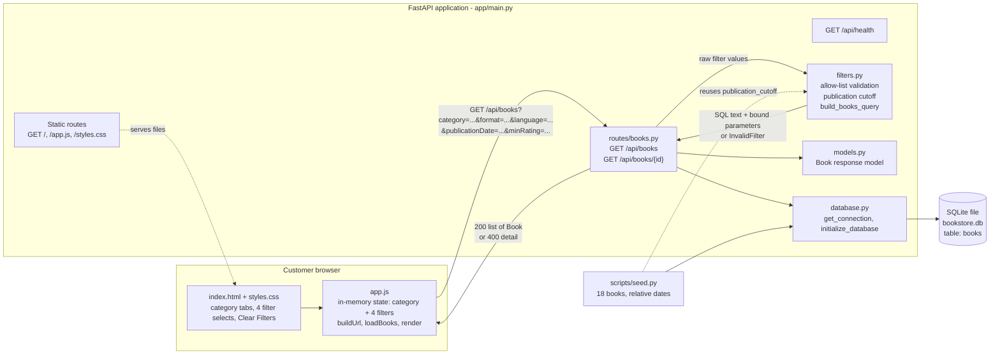
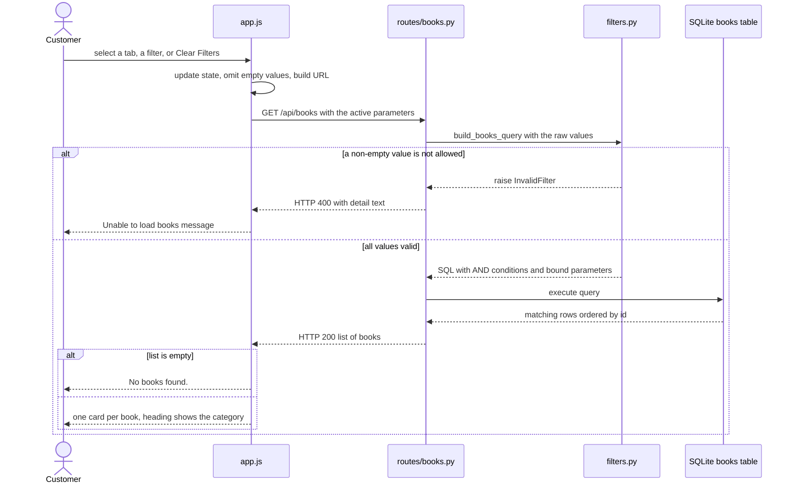
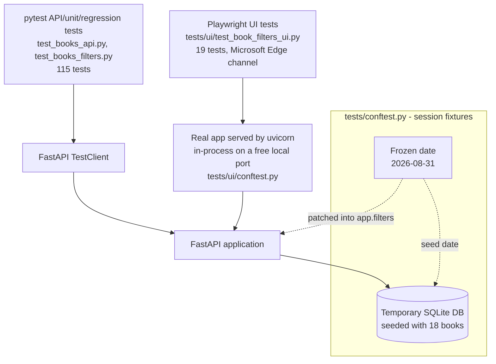
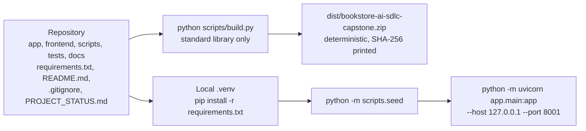

# High-Level Design (HLD)

## Advanced Filtering for Non-Fiction Books

| | |
|---|---|
| **Jira story** | EPMCDMETST-68481 |
| **Document date** | 2026-10-08 |
| **Baseline** | `main` at `7ff461d` |
| **Status** | Draft for review |
| **Related documents** | [FRD](FRD.md), [LLD](LLD.md), [TRACEABILITY](TRACEABILITY.md) |

> **Evidence note.** `docs/design/` does not exist in the repository, so no approved design document was available. This HLD is reconstructed from the implemented code, the "Design notes" in `README.md`, and the "Architecture / design" row in `PROJECT_STATUS.md`. It describes the system as built.

---

## 1. Purpose and Scope

This document describes the architecture that delivers advanced filtering (Book Format, Language, Publication Date, Customer Reviews) for Non-Fiction and Fiction books. It covers the components, their responsibilities, the request flow, the test and delivery architecture, and the design decisions. Field-level detail is in [LLD.md](LLD.md).

## 2. Architecture Summary

- A **single FastAPI application** serves both the REST API and the static browser frontend.
- Data lives in one **SQLite** file (`bookstore.db`), accessed with the standard-library `sqlite3` module. There is no ORM.
- The frontend is plain **HTML, CSS and JavaScript** with no framework and no build step.
- Filtering is implemented once, in **`app/filters.py`**, as a validated, parameterized query builder. Every category uses it.
- The database schema is **unchanged**. The filters use columns that already existed.

## 3. Architecture Diagram

## 4. Components

| Component | Location | Responsibility |
|---|---|---|
| Application entry | `app/main.py` | Creates the FastAPI app, creates the `books` table on startup, serves `/api/health`, mounts the books router, serves the three frontend files. |
| Books router | `app/routes/books.py` | Declares `GET /api/books` and `GET /api/books/{book_id}`. Maps the query parameters (`format`, `publicationDate`, `minRating` are aliases) to the query builder, converts `InvalidFilter` into HTTP 400, runs the query and returns `Book` objects. |
| Filter module | `app/filters.py` | Holds the allowed values, validates every filter, computes publication cutoff dates, and builds one parameterized `SELECT`. This is the single place where filtering rules live. |
| Response model | `app/models.py` | `Book` Pydantic model. Declares the response shape. |
| Database access | `app/database.py` | Opens SQLite connections (`DB_PATH` = `bookstore.db` at the repository root) and creates the `books` table if absent. |
| Seed script | `scripts/seed.py` | Replaces all rows with 18 books whose dates are relative to the run date. Reuses `publication_cutoff` so boundary books sit exactly on the cutoffs. |
| Frontend | `frontend/index.html`, `app.js`, `styles.css` | Category tabs, four filter selects, Clear Filters, result list and message states. Holds the selection state and calls the API. |
| Build script | `scripts/build.py` | Produces a deterministic ZIP in `dist/` (see section 8). |
| Tests | `tests/` | pytest API/unit tests and Playwright UI tests (see section 7). |

## 5. Request Flow

Key properties of the flow:

1. The category tab and the four filters are all query parameters of **one** endpoint. There is no category-specific code path.
2. Validation happens before any SQL runs.
3. User-supplied values never become SQL text. Only fixed column names and `?` placeholders are in the query string, and the cutoff date is computed on the server.
4. The browser omits empty values, and the server also treats an empty value as "no filter".

## 6. Design Decisions

| # | Decision | Rationale or effect | Source |
|---|---|---|---|
| D1 | One shared parameterized query builder serves Fiction and Non-Fiction. | Same filters and behavior for both categories. | `PROJECT_STATUS.md`; docstring in `app/filters.py` |
| D2 | Reuse `books.customer_rating` for Customer Reviews. Do not rename it to `customer_reviews`. | Column already stores customer ratings (REAL, 0 to 5). | `README.md` design notes |
| D3 | `minRating=N` maps to `customer_rating >= N`. Supported values are 3 and 4. | Matches the "N stars and above" options. | `README.md` |
| D4 | No schema change, no migration, no filters table. | `format`, `language`, `publication_date`, `customer_rating` already existed. Only seed data was extended. | `README.md`; `PROJECT_STATUS.md` |
| D5 | Filter values are validated against fixed allow-lists. Invalid non-empty values return 400 with a text `detail`. Empty means no filter. | Reject unsupported input consistently. | `README.md`; `PROJECT_STATUS.md`; commit `f8b12a7` |
| D6 | `minRating` is accepted as text and checked against `"3"` and `"4"`. | After `f8b12a7`, every invalid rating (for example `abc`, `3.5`, `0`, `-1`, `5`) is rejected by the application with the same 400 and `detail` shape as the other filters. | Commit `f8b12a7` diff; `README.md` |
| D7 | Filter selections persist when the category changes. Only Clear Filters resets them, and it keeps the category. | Intentional, so one filter set can be compared across categories. | `README.md` design notes |
| D8 | Publication windows use calendar arithmetic and an inclusive cutoff (`publication_date >= cutoff`). | Defines "last 6 months" and "last year" precisely, including month-end clamping. | `app/filters.py`; Gherkin |
| D9 | Seed dates are computed relative to the run date, with boundary books on and one day before each cutoff. | Keeps boundaries testable on any day. | `scripts/seed.py` |
| D10 | Tests freeze "today" at 2026-08-31 and use a temporary database. | Results do not depend on the run date. | `tests/conftest.py` |

## 7. Test Architecture

- The API tests and the UI tests exercise the **same application code** against the **same seeded database and frozen date**.
- UI expectations are derived from the seed definition and hard-coded cutoff dates, and API expectations from the unfiltered list filtered in Python. Neither relies on the filter code under test.
- Gherkin scenarios (`docs/testing/gherkin-non-fiction-filtering.feature`) define the expected behavior and are tagged `@api` or `@ui` by the layer that covers them.

## 8. Build and Deployment View

| Aspect | Fact | Source |
|---|---|---|
| Deployment target | Local machine (Windows 11 Enterprise), virtual environment, Uvicorn. | `deployment-report.md` |
| Method | Follows the README steps: install requirements, seed, run Uvicorn. Run at `http://127.0.0.1:8001` because port 8000 was already in use by another instance. The README default is port 8000. | `deployment-report.md` section 8 |
| Build artifact | `dist/bookstore-ai-sdlc-capstone.zip`. Fixed entry order, timestamps, permissions and compression, so the same sources give the same bytes. The script verifies the archive and prints size and SHA-256. | `scripts/build.py` |
| Excluded from the artifact | `.git`, `.venv`, `venv`, `__pycache__`, `.idea`, `.claude`, `.codemie`, `dist`, `.pytest_cache`, `*.pyc`, `*.pyo`, `*.db`, `*.sqlite`, `.env` | `scripts/build.py` |
| Docker | **Not used.** The repository has no Dockerfile or docker-compose file and Docker is not installed on the deployment machine. | `deployment-report.md` |
| CI/CD | **No pipeline is present** in the repository. | repository contents |

## 9. Quality Attributes

| Attribute | How the design addresses it | Limits |
|---|---|---|
| **Security** | Allow-list validation, bound SQL parameters, fixed column names. SQL-injection style values return 400 and data is unchanged. Frontend output is HTML-escaped (`escapeHtml`). | Security testing beyond input validation was not performed. |
| **Maintainability** | Filtering rules live in one module. No duplication per category. | Allowed values are duplicated in `filters.py` and `index.html` (the dropdown options). |
| **Testability** | Injectable `today` parameter, frozen test clock, temporary database, in-process live server. | |
| **Reproducibility** | Deterministic build; relative seed dates. | The recorded SHA-256 applies only to the tree that was built (see TRACEABILITY section 6). |
| **Compatibility** | Existing endpoints, table and category behavior unchanged. | |
| **Performance** | Not evaluated. The query has no index and no pagination. | Large data volumes untested. |
| **Browser support** | UI verified in Microsoft Edge only. | Other browsers not run. |

## 10. Constraints, Risks and Known Limitations

| # | Item | Impact | Source |
|---|---|---|---|
| 1 | Future-dated books match every publication window (no upper bound). | Wrong results if such data is added. Not visible with the current seed. | OBS-1 |
| 2 | Repeated query parameters are accepted (last value wins). | Invalid earlier values can be hidden. | OBS-2 |
| 3 | Browser does not cancel earlier requests. | Out-of-order results possible on slow networks. Not reproduced. | OBS-3 |
| 4 | UI tests ran only in Edge. | Browser-specific problems elsewhere would go undetected. | `PROJECT_STATUS.md`; validation report |
| 5 | Default `python -m pytest` shows 19 errors on the development machine (Playwright Chromium not installed). | Can be mistaken for failures. Use `--browser-channel msedge`. | validation report section 9 |
| 6 | Small seed set (18 books). | Boundary and AND tests depend on the added "Mark" and "Just Past" books. | validation report section 10 |
| 7 | `@app.on_event("startup")` is deprecated in FastAPI. | Existing warning in every test run. Unrelated to this story. | validation report section 8 |
| 8 | `/favicon.ico` returns 404. | Cosmetic console error. | `deployment-report.md` section 8 |

## 11. Not Present in the Repository

To avoid ambiguity, the following are **not** part of the system as built: Docker or container images, CI/CD pipelines, authentication or authorization, an ORM, database migrations, a client-side framework, pagination, sorting, free-text search, caching.
