# Traceability Matrix

## Jira EPMCDMETST-68481: Advanced Filtering for Non-Fiction Books

| | |
|---|---|
| **Jira story** | EPMCDMETST-68481 |
| **Document date** | 2026-10-08 |
| **Baseline** | `main` at `7ff461d` |
| **Status** | Draft for review |
| **Related documents** | [FRD](FRD.md), [HLD](HLD.md), [LLD](LLD.md) |

This document traces the story through: **requirements, planning, design, implementation, code review, testing, build, deployment**. Requirement IDs `FR-01` to `FR-15` are defined in the [FRD](FRD.md).

## 1. How to Read This Document

| Marker | Meaning |
|---|---|
| **Found** | A repository artifact exists and was read. |
| **Partial** | Only indirect evidence exists (for example a status note or a commit message). |
| **Not found** | The expected artifact is not in the repository or its history. Nothing was invented to fill the gap. |

File and line references (`file:line`) are to the baseline commit.

## 2. Lifecycle Overview

```mermaid
flowchart LR
    REQ["1. Requirements<br/>Jira EPMCDMETST-68481<br/>FRD FR-01 to FR-15<br/>Jira text: not in repo"]
    PLAN["2. Planning<br/>docs/planning: NOT FOUND<br/>PROJECT_STATUS phases<br/>and deferred list"]
    DES["3. Design<br/>docs/design: NOT FOUND<br/>README design notes<br/>HLD and LLD reconstructed"]
    IMP["4. Implementation<br/>commit dacb1e2<br/>feat: add advanced book filtering"]
    REV["5. Code review<br/>outcome: approved with<br/>minor changes<br/>fixes in commit f8b12a7<br/>review report: not in repo"]
    TST["6. Testing<br/>commit 1b61c63<br/>37 Gherkin scenarios<br/>134 tests pass<br/>validation: APPROVED"]
    BLD["7. Build<br/>commit 7ff461d<br/>scripts/build.py<br/>BUILD SUCCESS"]
    DEP["8. Deployment<br/>commit 7ff461d<br/>local, Uvicorn<br/>SUCCESS"]

    REQ --> PLAN --> DES --> IMP --> REV --> TST --> BLD --> DEP

    classDef gap fill:#fde68a,stroke:#b45309,color:#000
    class PLAN,DES gap
```

Amber stages have a documentation gap (see section 9).

## 3. Stage-by-Stage Trace

| # | Stage | Evidence status | Artifacts and commits | Outcome |
|---|---|---|---|---|
| 1 | **Requirements** | **Partial** | Jira ticket text is not in the repository. Requirement sources are: `PROJECT_STATUS.md` in `ee70f2b` (lists "Advanced Non-Fiction filters" as deferred), the user story in the Gherkin header (`1b61c63`), the objective in `docs/testing/test-validation-report.md` section 1, and `README.md` "Filtering". Reconstructed in [FRD.md](FRD.md). | Acceptance criteria were taken from the validation request; the Jira ticket was not accessible. |
| 2 | **Planning** | **Not found** | `docs/planning/` does not exist. Indirect evidence only: Phase 1 and Phase 2 structure and the deferred-work list in `PROJECT_STATUS.md`. | No plan, estimate or task breakdown is recorded. |
| 3 | **Design** | **Partial** | `docs/design/` does not exist. Design decisions are recorded in `README.md` "Design notes (EPMCDMETST-68481)" and the "Architecture / design" row of `PROJECT_STATUS.md`, plus the docstring in `app/filters.py:42`. Reconstructed in [HLD.md](HLD.md) and [LLD.md](LLD.md). | Design status in `PROJECT_STATUS.md`: Done. |
| 4 | **Implementation** | **Found** | `dacb1e2` (feat: add advanced book filtering): 14 files, +775 / -43. New `app/filters.py`; changed `app/routes/books.py`, `frontend/app.js`, `frontend/index.html`, `frontend/styles.css`, `scripts/seed.py`, `requirements.txt` (adds `pytest-playwright`), `README.md`; new tests and `docs/testing/test-execution-report.md`. | Development status: Done. |
| 5 | **Code review** | **Partial** | The review report is not in the repository. Evidence: `PROJECT_STATUS.md` ("Review of commit dacb1e2 returned 'approved with minor changes'; the approved changes are implemented in the follow-up work") and `f8b12a7` (fix: address code review findings): 8 files, +250 / -80. See section 6. | Approved with minor changes; changes implemented. |
| 6 | **Testing** | **Found** | Tests: `tests/` (in `dacb1e2`, extended in `f8b12a7`). Scenarios and report: `1b61c63` adds `docs/testing/gherkin-non-fiction-filtering.feature` (37 scenarios) and `docs/testing/test-validation-report.md`. Run log: `docs/testing/test-execution-report.md`. | **134 passed, 0 failed** in Microsoft Edge. Validation result: **APPROVED**. |
| 7 | **Build** | **Found** | `7ff461d` adds `scripts/build.py`, a `dist/` entry in `.gitignore`, and `docs/deployment/deployment-report.md`. | `BUILD SUCCESS`, 29,675 byte ZIP, SHA-256 `fac352be...f08962` (see section 8). |
| 8 | **Deployment** | **Found** | `docs/deployment/deployment-report.md` (committed in `7ff461d`). Deployed from `1b61c63` plus then-uncommitted build files. | **SUCCESS**, local, `http://127.0.0.1:8001`. |

## 4. Commit Ledger

| Commit | Date and time (+0530) | Message | Stage |
|---|---|---|---|
| `ee70f2b` | 2026-10-08 14:21 | chore: initialize bookstore application | Baseline (Phase 1) |
| `49ef029` | 2026-10-08 15:02 | chore: initialize bookstore application | Baseline (README and requirements tweak) |
| **`dacb1e2`** | 2026-10-08 18:57 | feat: add advanced book filtering | 4 Implementation |
| **`f8b12a7`** | 2026-10-08 19:38 | fix: address code review findings for EPMCDMETST-68481 | 5 Code review |
| **`1b61c63`** | 2026-10-08 20:44 | test: add Gherkin scenarios and validation report for EPMCDMETST-68481 | 6 Testing |
| **`7ff461d`** | 2026-10-08 21:12 | build: add reproducible build and deployment evidence for EPMCDMETST-68481 | 7 Build, 8 Deployment |

Bold rows are the four commits named as authoritative for this story.

## 5. Requirement Trace Matrix

### 5.1 Requirements to design and implementation

HLD decisions are `D1` to `D10` (HLD section 6). LLD references are section numbers.

| ID | Requirement | Design | Implementation |
|---|---|---|---|
| FR-01 | Browse All, Fiction, Non-Fiction | HLD D1; LLD 2.1, 6.1 | `app/filters.py:46-50`; `frontend/index.html:12-16`; `frontend/app.js:53-60` |
| FR-02 | Four filter controls in every category | HLD D1, D7; LLD 6.1 | `frontend/index.html:17-52`; `frontend/styles.css` (`.filters`) |
| FR-03 | Book Format filter | HLD D1, D5; LLD 2.1, 3.1, 4 | `app/filters.py:5, 51-55`; `app/routes/books.py:11` |
| FR-04 | Language filter | HLD D1, D5; LLD 2.1, 3.1, 4 | `app/filters.py:6, 56-60`; `app/routes/books.py:12` |
| FR-05 | Publication Date filter | HLD D8, D9; LLD 3.2 | `app/filters.py:15-31, 61-64`; `scripts/seed.py:11-13, 27-32` (boundary books) |
| FR-06 | Customer Reviews minimum rating | HLD D2, D3, D6; LLD 3.1, 5.1 | `app/filters.py:8, 65-70`; `app/routes/books.py:14`; column `customer_rating` (`app/database.py:20`) |
| FR-07 | Filters combine with AND | HLD D1; LLD 3.1 | `app/filters.py:72-74` |
| FR-08 | Empty value means no filter | LLD 3.1, 4 | truthiness checks in `app/filters.py:46-65`; `frontend/app.js:11` |
| FR-09 | Clear Filters keeps category | HLD D7; LLD 6.3 | `frontend/app.js:69-75` |
| FR-10 | Filters persist across categories | HLD D7; LLD 6.3 | `frontend/app.js:53-60` (tab handler does not touch the filters) |
| FR-11 | Fiction and Non-Fiction parity | HLD D1; LLD 3.1 | one shared builder, no category-specific branch (`app/filters.py:34-76`) |
| FR-12 | Invalid value gives HTTP 400 | HLD D5, D6; LLD 2.2, 4, 7 | `app/filters.py:11, 31, 48, 53, 58, 68`; `app/routes/books.py:20-21` |
| FR-13 | "No books found." and recovery | LLD 6.3, 6.4 | `frontend/app.js:25-28` |
| FR-14 | Load-failure message | LLD 6.3, 6.5 | `frontend/app.js:40-45` |
| FR-15 | Existing behavior unchanged | LLD 2.3 | `app/routes/books.py:26-34`; `app/main.py:20-22` |

### 5.2 Requirements to review, tests and deployment

Test location prefixes: **F** = `tests/test_books_filters.py`, **A** = `tests/test_books_api.py`, **U** = `tests/ui/test_book_filters_ui.py`. Parametrized tests are listed once.

| ID | Code review change (`f8b12a7`) | Automated tests | Gherkin scenarios (feature file) | Deployment evidence (`deployment-report.md`) |
|---|---|---|---|---|
| FR-01 | none | F `test_unfiltered_returns_both_categories`, `test_category_only_returns_that_category`; A `test_nonfiction_category`; U `test_category_controls_are_available` | "Non-Fiction category returns only Non-Fiction books"; "Category behavior without advanced filters is unchanged" | API #2 (18 books), #3 (12 Non-Fiction); UI All Books 18 cards, Non-Fiction 12 cards |
| FR-02 | none | U `test_non_fiction_shows_all_four_filter_groups` | "Non-Fiction shows all four filter groups with the approved options" | UI: four filters visible and enabled; options verified |
| FR-03 | Allow-list added | F `test_format_filter`, `test_valid_format_values_are_accepted_exactly`; U `test_multiple_filters_format_and_language` | "Filter Non-Fiction and Fiction books by Book Format"; "Select a Book Format in the browser (Non-Fiction)"; "Every valid format is accepted with its exact spelling" | API #4 (4 books); UI Non-Fiction + Hardcover = 4 cards |
| FR-04 | Allow-list added | F `test_language_filter`, `test_valid_language_values_are_accepted_exactly`; U `test_single_filter_language` | "Filter Non-Fiction and Fiction books by Language"; "Select a single Language in the browser (Non-Fiction)"; "Every valid language is accepted with its exact spelling" | API #6 (4 books) |
| FR-05 | none | F `test_publication_date_filter`, `test_publication_date_windows_are_nested`, `test_publication_date_boundaries`, `test_subtract_months_clamps_to_month_end`, `test_cutoffs_use_calendar_arithmetic`; U `test_publication_date_window_non_fiction_includes_boundary_book` (3), `test_publication_date_window_fiction` (3), `test_publication_date_windows_are_nested` | "Filter by Publication Date window"; "Publication Date cutoff is inclusive"; "Publication Date windows are nested"; "Six months back from a month-end date is clamped to the last day of the shorter month" | API #7 (3 books) |
| FR-06 | `minRating` changed from integer to text, checked against 3 and 4 | F `test_min_rating_filter`, `test_min_rating_boundaries_are_inclusive`, `test_valid_min_rating_is_accepted`; U `test_minimum_rating_four_stars`, `test_minimum_rating_three_stars` | "Filter by minimum Customer Reviews rating"; "Minimum rating boundaries are inclusive"; "Select 4 stars and above in the browser (Non-Fiction)"; "Select 3 stars and above in the browser (Fiction)" | API #5 (3 books) |
| FR-07 | none | F `test_documented_example_combination`, `test_all_filters_combine_with_and`, `test_combined_filters_narrow_single_filter_results`; U `test_multiple_filters_format_and_language` | "Book Format and Language combine with AND in the browser"; "All four filters combine with AND (documented example)"; "Four filters together return only books that match every filter"; "Adding a filter narrows the result" | API #8 (1 book); UI Hardcover + Last year + 4 stars = 1 card ("History of Modern Cities") |
| FR-08 | Empty `minRating` now ignored; test extended | F `test_empty_filter_values_are_ignored`, `test_min_rating_empty_means_no_rating_filter` | "Empty filter values mean no filter" | none |
| FR-09 | none | F `test_clearing_filters_restores_full_category` (2); U `test_clear_filters_resets_filters_and_keeps_category` (2) | "Clear Filters resets all filters and keeps the selected category"; "Requesting the category without filters restores the full category list" | UI: Clear Filters returns to 12 cards and stays on Non-Fiction |
| FR-10 | none | U `test_filters_persist_when_switching_category` (2) | "Filter selections persist when switching category" | none |
| FR-11 | none | F `test_fiction_and_nonfiction_share_filter_behaviour`; U `test_filters_work_the_same_in_fiction_and_non_fiction` | "Fiction and Non-Fiction expose the same filters and behave the same way"; "The same filter value selects matching books in both categories" | Non-Fiction only was checked |
| FR-12 | Allow-lists added; text `minRating` validation; SQL-injection test now expects 400 | F `test_invalid_format_returns_400` (21), `test_invalid_language_returns_400` (18), `test_invalid_min_rating_returns_400` (5), `test_invalid_filter_values_return_400` (3), `test_invalid_value_is_rejected_even_alongside_valid_filters`, `test_sql_injection_attempt_is_rejected_and_leaves_data_intact`; A `test_invalid_category` | "Invalid format is rejected" (and within a category); "Invalid language is rejected" (and within a category); "Invalid minimum rating is rejected"; "Invalid publication window is rejected"; "An invalid value is rejected even when other filters are valid"; "SQL injection style values are rejected and data is unchanged" | API #9 (`format=pdf` gives 400 `Unsupported format`) |
| FR-13 | none | F `test_no_match_returns_empty_list`; U `test_no_results_state_and_recovery` | "A combination with no matches returns an empty list"; "No-results message is shown and the list recovers after Clear Filters" | none |
| FR-14 | none | **none** (untested) | **none** | none |
| FR-15 | none | A `test_health`, `test_list_books`, `test_nonfiction_category`, `test_invalid_category`, `test_missing_book` | "Category behavior without advanced filters is unchanged" | API #1 (health 200), #2 |

**Build coverage (all requirements):** every file that implements and tests the requirements above (`app/`, `frontend/`, `scripts/`, `tests/`, `docs/`) is included in the build artifact by `scripts/build.py`. The build does not run tests. The deployment report records a test run on an extracted copy of the ZIP: 115 passed (UI tests were not run on that copy).

## 6. Code Review Trace

The review report itself is **not in the repository**. The only recorded outcome is "approved with minor changes". The table lists what commit `f8b12a7` changed, and how each change is verified. It does not claim that each item was a numbered review finding.

| # | Change in `f8b12a7` | Location | Verified by |
|---|---|---|---|
| 1 | `FORMATS` and `LANGUAGES` allow-lists added. Unsupported non-empty values raise `InvalidFilter` (HTTP 400). | `app/filters.py:5-6, 51-58` | F `test_invalid_format_returns_400`, `test_invalid_language_returns_400`, `test_valid_format_values_are_accepted_exactly`, `test_valid_language_values_are_accepted_exactly` |
| 2 | `minRating` changed from an integer to text (`int` to `str`, both optional). The value is mapped through `{"3": 3, "4": 4}`; anything else raises `InvalidFilter`. | `app/routes/books.py:14`; `app/filters.py:39, 65-70` | F `test_invalid_min_rating_returns_400`, `test_valid_min_rating_is_accepted` |
| 3 | Empty `minRating` is treated as no filter. | `app/filters.py:65` | F `test_min_rating_empty_means_no_rating_filter`; `test_empty_filter_values_are_ignored` extended with `minRating=""` |
| 4 | SQL-injection test changed from "treated as literal, returns 200 and an empty list" to "rejected with 400, data unchanged". | `tests/test_books_filters.py` | F `test_sql_injection_attempt_is_rejected_and_leaves_data_intact` |
| 5 | UI tests expanded from 8 to 19. Backend tests expanded from 60 to 115. | `tests/` | Test execution report |
| 6 | `README.md` documents case sensitivity, empty-value handling and the 400 behavior. | `README.md` "Filtering" | Document review |
| 7 | `PROJECT_STATUS.md` gains the Phase 2 status table. "Advanced Non-Fiction filters" and "Playwright end-to-end automation" are removed from the deferred list. | `PROJECT_STATUS.md` | Document review |
| 8 | `.gitignore` rewritten. The earlier file held literal `\n` text on one line. Adds `*.pyc`, `bookstore.db`, `.claude/`, `.codemie/`. | `.gitignore` | Document review |

## 7. Test Result Trace

| Evidence | Result | Source |
|---|---|---|
| Gherkin scenarios | 37 (17 outlines). 27 tagged `@api`, 12 tagged `@ui`, 2 tagged both. | `docs/testing/gherkin-non-fiction-filtering.feature` |
| Tests after the feature commit `dacb1e2` | 60 API + 8 UI = 68 passed in Edge | `test-execution-report.md` as committed in `dacb1e2` |
| API, unit, regression | 115 passed (5 in `test_books_api.py`, 110 in `test_books_filters.py`) | validation report section 5 |
| Playwright UI | 19 passed, Microsoft Edge via `--browser-channel msedge` | validation report section 6 |
| Full suite in Edge | **134 passed, 0 failed, 3 warnings** | validation report section 8 |
| Full suite, default browser | 115 passed, 19 errors (Playwright Chromium not installed, an environment problem) | validation report section 9 |
| Mutation checks (outside the repository) | 11 deliberate breakages, all caught. One was ineffective at first (the `hidden` attribute is overridden by `display:flex`) and was caught when redone with `display:none`. | validation report section 8 |
| Test validation verdict | **APPROVED**, no blocking or functional defects. Low-severity observations OBS-1 to OBS-3. | validation report sections 10, 12 |
| Test counts re-checked for this package | `pytest --collect-only` gives 115 non-UI tests (5 + 110) and 19 UI tests, matching the reports. | Run on 2026-10-08 |

## 8. Build and Deployment Trace

| Item | Value | Source |
|---|---|---|
| Build command | `python scripts/build.py` | `deployment-report.md` section 5 |
| Artifact | `dist/bookstore-ai-sdlc-capstone.zip` (gitignored) | same |
| Size / files / result | 29,675 bytes / 24 files / BUILD SUCCESS (exit code 0) | same |
| SHA-256 | `fac352be45f8a08bacac469c2163f371bee8a08fb341eb1fd0277effd8f08962` | same |
| Build checks | Two runs gave the same hash. `testzip()` clean. Listing opened with Python and .NET. No excluded paths found. | same |
| Extracted-copy check | Seeded 18 books. `pytest --ignore=tests/ui`: 115 passed. UI tests not run. | same |
| Deployment method | `.venv`, `pip install -r requirements.txt`, `python -m scripts.seed` (18 books), `python -m uvicorn app.main:app --host 127.0.0.1 --port 8001` | `deployment-report.md` section 4 |
| Deployment URL | `http://127.0.0.1:8001` (API docs at `/docs`, HTTP 200) | same |
| API verification | 9 requests, all as expected (section 5.2 lists them by requirement) | `deployment-report.md` section 6 |
| UI verification | Playwright, headless Microsoft Edge, 9 checks passed. One console error: `GET /favicon.ico` returned 404. | `deployment-report.md` sections 7, 8 |
| Result | **SUCCESS** | `deployment-report.md` section 10 |
| Container deployment | Not used. No Dockerfile or docker-compose file exists and Docker is not installed on the machine. | `deployment-report.md` section 8 |

**Reproducibility caveat.** The SHA-256 above belongs to the tree that was built on 2026-10-08. The build includes `docs/`, so adding or editing any documentation file changes the hash. Running `scripts/build.py`'s file collection on the baseline tree today lists **25** files (the report says 24). The cause of the difference was not investigated. Adding these four documents would raise the count to 29.

## 9. Gaps, Discrepancies and Open Items

| # | Finding | Effect on traceability | Suggested action |
|---|---|---|---|
| 1 | `docs/planning/` does not exist (working tree and all commits). | Planning stage cannot be traced to a plan. | Add the planning artifact if one exists outside the repository. |
| 2 | `docs/design/` does not exist. | Design stage is traced to README notes and code only. HLD and LLD are reconstructed from the implementation. | Review HLD and LLD against any approved design held elsewhere. |
| 3 | Jira ticket text and acceptance criteria are not in the repository. The validation report says the criteria came from the validation request, and the ticket was not accessible. | `FR-xx` cannot be tied to Jira acceptance-criteria numbers. | Add the criteria to the FRD when available, and re-map. |
| 4 | The code review report is not in the repository. | Review findings are inferred from the fix commit and `PROJECT_STATUS.md`. | Store the review report under `docs/`. |
| 5 | The story says "same as Fiction", but no advanced filtering for any category existed before `dacb1e2`. | Parity is traced to the shared implementation, not to a pre-existing Fiction feature. | Confirm the intent with the story owner. |
| 6 | `PROJECT_STATUS.md` still lists "Build/deployment automation" and "Documentation synchronization" as deferred. `7ff461d` added `scripts/build.py` and a deployment report but did not update the status file. | Status file is behind the repository for build and deployment. | Update `PROJECT_STATUS.md` (not changed in this task). |
| 7 | `README.md` does not mention `scripts/build.py`, and its URLs use port 8000 while the deployment used 8001 (port 8000 was occupied by another instance). | Run instructions differ from the recorded deployment. | Document the build command and the port note. |
| 8 | Build file count: 24 in the deployment report, 25 on the baseline tree today. Hash cannot be reproduced after any `docs/` change. | Build evidence applies to the tree at build time only. | Re-run the build after documentation is final and record the new hash. |
| 9 | UI tests ran in Microsoft Edge only. Pytest labels the tests `[chromium]` because Edge is driven through Playwright's `chromium` type. No Chromium-binary, Firefox or WebKit results exist. | Browser coverage is limited to Edge. | Install Playwright Chromium or run UI tests in CI. |
| 10 | FR-14 (load-failure message) has no test. FR-08, FR-10, FR-13 and FR-11 have no deployment-run evidence. | Verification depth differs by requirement. | Add a UI test for the error state. |
| 11 | OBS-1 (no upper bound on dates), OBS-2 (repeated parameters), OBS-3 (no request cancellation) are open low-severity observations. | None blocks the story. Recorded as decisions pending. | Decide and track outside this story. |
| 12 | The deployment run shares `bookstore.db` with another running instance on port 8000 whose code version was not verified. Seeding replaced its data. | Deployment evidence covers the port 8001 instance only. | None. Recorded for completeness. |
| 13 | Three deprecation warnings appear in every run (`httpx` with `starlette.testclient`; `on_event` twice). | Unrelated to the story. | None for this story. |
| 14 | These four documents are new and **uncommitted** at the time of writing. | The baseline commit does not contain them. | Commit when approved. |
